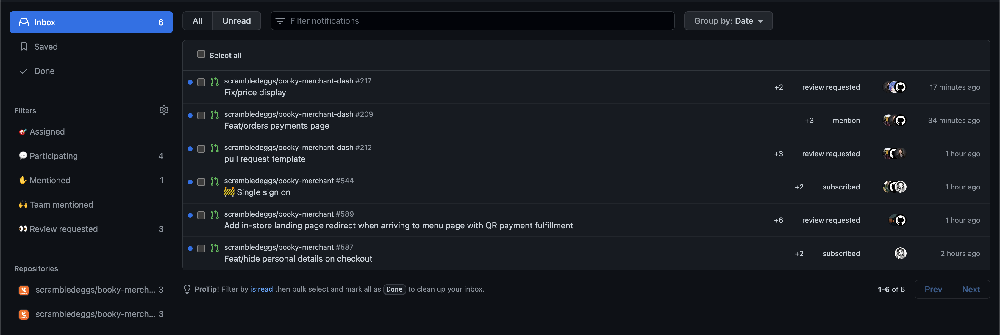

# Tmux Github Notif

A simple tmux plugin that displays your Github notification count in your tmux status line




## Requirements
- [jd](https://github.com/stedolan/jq) for parsing the github api response
- [Nerd Font](https://www.nerdfonts.com/) to display octocat icon

## Setup
- Add `$GITHUB_TOKEN` as env variable defined in your `.bashrc` or `.zshrc`. 

```bash
export GITHUB_TOKEN=your_personal_token
```

See [here](https://docs.github.com/en/authentication/keeping-your-account-and-data-secure/creating-a-personal-access-token) on how to generate your own github personal access token

## Usage
- Add `#{gh_notif}` to your `status-left` or `status-right` `.tmux.conf`

## Installation
**[Tmux Plugin Manager](https://github.com/tmux-plugins/tpm) (Recommended)**

Add this plugin to the list of TPM plugins in your `.tmux.conf`:

```
set -g @plugin 'jettandres/tmux-github-notif'
```

Hit prefix + I to fetch the plugin and source it.
